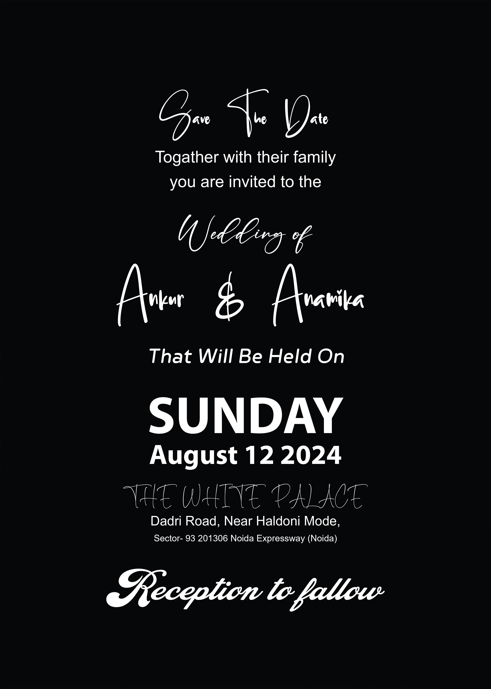

# Ai_Generated_Card
This could refer to a specialized hardware accelerator designed to speed up artificial intelligence (AI) and machine learning (ML) workloads. Examples include NVIDIA GPUs for deep learning.
<h1>Sample of Generated Card</h1>

</head>
<body>
  

    

      <!-- Site Header -->
      

        

          

            <i class="fas fa-coffee fa-3x tm-site-logo"></i>
            <h1 class="tm-site-name">AI Card</h1>
          

          <nav class="tm-site-nav">
            <ul class="tm-site-nav-ul">
              <li class="tm-page-nav-item">
                <a href="#drink" class="tm-page-link active">
                  <i class="fas fa-mug-hot tm-page-link-icon"></i>
                  BASIC
                </a>
              </li>
              <li class="tm-page-nav-item">
                <a href="#about" class="tm-page-link">
                  <i class="fas fa-users tm-page-link-icon"></i>
                  About Us
                </a>
              </li>
              <li class="tm-page-nav-item">
                <a href="#special" class="tm-page-link">
                  <i class="fas fa-glass-martini tm-page-link-icon"></i>
                  Special
                </a>
              </li>
              <li class="tm-page-nav-item">
                <a href="#contact" class="tm-page-link">
                  <i class="fas fa-comments tm-page-link-icon"></i>
                  Contact
                </a>
              </li>
            </ul>
          </nav>
        
        
      

      

        <main class="tm-main">
          

            <!-- Drink Menu Page -->
            <nav class="tm-black-bg tm-drinks-nav">
              <ul>
                <li>
                  <a href="#" class="tm-tab-link active" data-id="cold">Sample 1</a>
                </li>
                <li>
                  <a href="#" class="tm-tab-link" data-id="hot">Sample 2</a>
                </li>
                <li>
                  <a href="#" class="tm-tab-link" data-id="juice">Sample 3</a>
                </li>
              </ul>
            </nav>

            

              

                
          
                  
                  

                    <h3 class="tm-list-item-name"><a href="/sample1"><button type="button" class="btn btn-primary">Generate Card Sample1</button></a>
                    </h3>
                    
Enter Desired Details For Generate Card

                  

                

                
                                       
              

            
 
